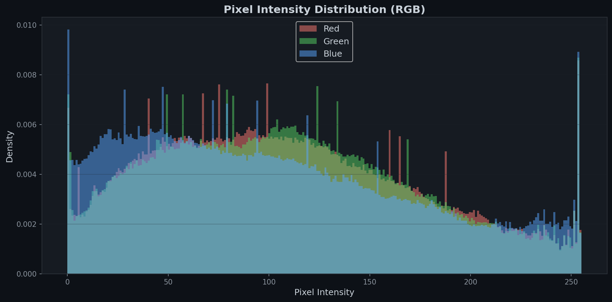
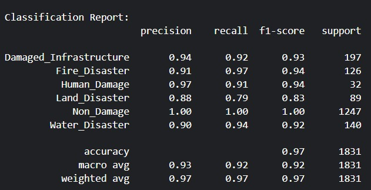
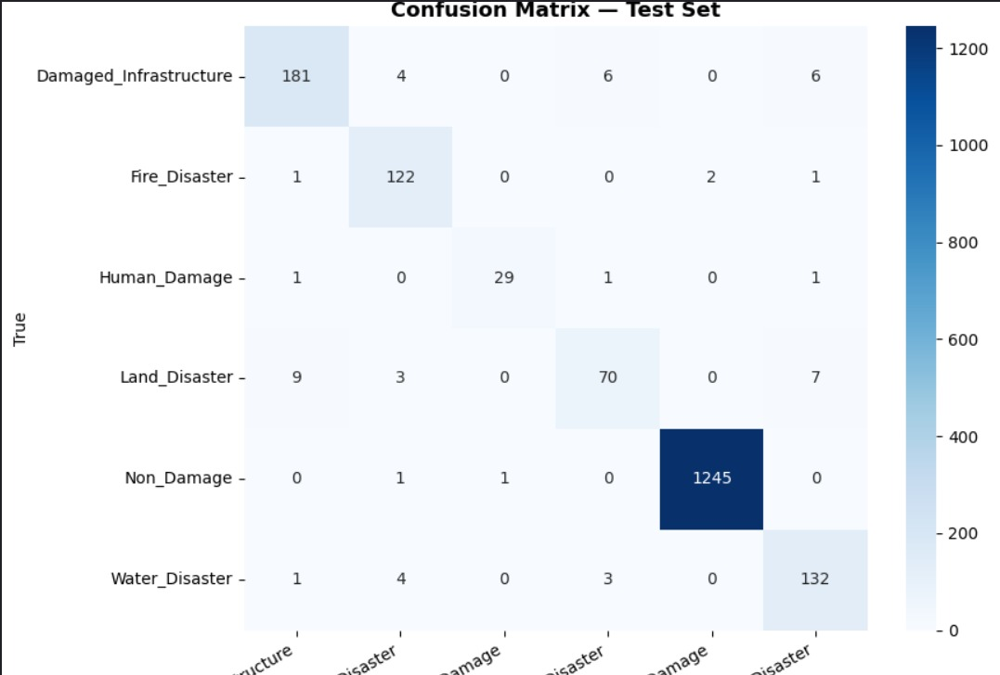
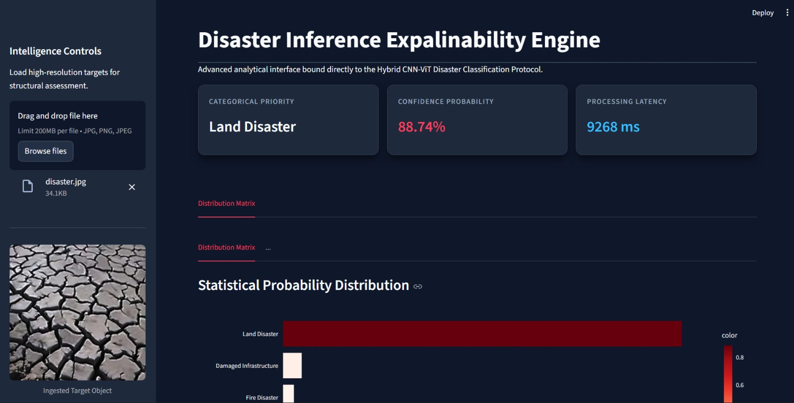
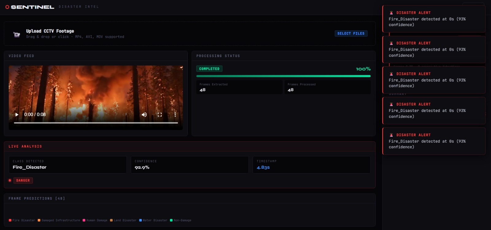

## EDA and Preprocessing Results
1. Class Distruibution

<br><br>
2. Width , Hight, Aspect ration

<br><br>
3. Sample Images

<br><br>
4. MEan RGB per class

<br><br>
5. Box Plot and Lalacian Variance

<br><br>
6. After Preprocessing comparision

<br>
<br>
7. Channel Mean and standard deviation


<br>

8. RGB Intensity


 ---
## Model trained for SHAP(SHapley Additive exPlanations) for visualization and analysis
1. Model used : Ensemble learning using efficientNetB3 + CBAM(The Concerns Based Adoption Model)
   - **Results**
   - Accuracy Matrix 
     
   - Confusion Matrix
     
   - SHAP Visualization
     

## Contents

1. Project Summary
2. Folder Structure
3. Stage A — Data Analysis & Preprocessing
4. Stage B — Model Training & Ensemble Strategy
5. Key Design Choices
6. Running the Project on Kaggle
7. Output Files Guide
8. Troubleshooting

---

## 1. Project Summary

This project is built as a **two-phase system** designed for the *Comprehensive Disaster Dataset (CDD)*.

### Phase 1 — Data Understanding & Preparation

The first script focuses on exploring the dataset and preparing it for training. It analyzes image characteristics, cleans inconsistencies, and converts raw images into normalized formats.

### Phase 2 — Model Training & Prediction

In the second phase, two advanced architectures are trained separately:

* EfficientNet-B5 (CNN-based)
* ViT-B/16 (Transformer-based)

Their predictions are later combined using **weighted averaging** to improve overall accuracy.

The dataset is organized into multiple folders, each representing a disaster type such as floods, fires, or infrastructure damage.

---

## 2. Folder Structure

```
project/
  disaster_eda_preprocessing_kaggle.py
  efficientnet_vit_ensemble_pipeline.py
  pipeline_flowchart.html
  README.md

/kaggle/working/outputs/
  efficientnet_b5_best.pth
  vit_b16_best.pth
  accuracy_comparison.png
  confusion_matrix.png
  per_class_metrics.csv
  submission.csv

/kaggle/working/pipeline_outputs/
  eda/
  preprocessing/
```

---

## Stage A — Data Analysis & Preprocessing

### Configuration Setup

Basic parameters such as random seeds, valid file formats, image size, and sampling limits are defined here.

* Ensures **reproducibility**
* Maintains **consistent image dimensions**
* Limits dataset sampling for faster analysis

---

### Automatic Dataset Detection

Instead of hardcoding paths, the system intelligently searches through directories to find the dataset based on keyword matching.

This makes the code more **portable and robust**, especially in environments like Kaggle where dataset paths may differ.

---

### Collecting Image Data

* Reads all image paths
* Assigns numeric labels to classes
* Ensures consistent ordering across runs

Hidden/system files are ignored, and multiple formats are supported.

---

### Class Distribution Analysis

A bar graph is generated showing how many images belong to each category.

This helps identify:

* Class imbalance
* Need for weighted training or resampling

---

### Image Dimension Analysis

A sample of images is analyzed to extract:

* Width and height
* Aspect ratio
* Corrupt files

This step helps determine if resizing or padding strategies are required.

---

### Visual Inspection Grid

Sample images from each class are displayed in a grid format.

This allows quick verification of:

* Label correctness
* Visual diversity
* Data quality

---

### Color Distribution (Mean RGB)

Each class is analyzed for average color intensity.

Insights:

* Fire images may show higher red values
* Water-related images may lean toward blue tones

This helps understand feature separability.

---

### Brightness & Blur Detection

Two key metrics are calculated:

* Brightness (average grayscale intensity)
* Blur (edge variance using Laplacian)

This step identifies:

* Low-quality images
* Overexposed or blurry samples

---

### Image Preprocessing Pipeline

Each image goes through:

1. Resize while maintaining aspect ratio
2. Add padding to fit target size
3. Remove noise using denoising techniques
4. Enhance contrast using CLAHE
5. Normalize pixel values to [0,1]

This ensures clean and standardized inputs for models.

---

### Dataset Statistics

A subset of processed images is used to compute:

* Mean pixel values
* Standard deviation

These are later used for normalization during training.

---

## Stage B — Model Training & Ensemble

### Configuration

All hyperparameters are grouped into a single configuration class.

Includes:

* Batch size
* Learning rate
* Epoch count
* Gradient clipping
* Label smoothing

---

### Stratified Data Splitting

The dataset is divided into:

* Training (80%)
* Validation (10%)
* Testing (10%)

Each split maintains equal class distribution to avoid bias.

---

### Data Augmentation

Training images are randomly transformed using:

* Flipping and rotation
* Brightness/contrast adjustments
* Blur and noise
* Cutout (random occlusion)

Validation data remains unchanged for fair evaluation.

---

### Custom Dataset Loader

Handles:

* Image loading
* Transformations
* Error handling (fallback for corrupt files)

Efficient memory usage through lazy loading.

---

### EfficientNet-B5 Model

* Pretrained on ImageNet
* Uses global feature extraction
* Custom classification head added

Chosen for strong performance on image tasks.

---

### Vision Transformer (ViT-B/16)

* Splits images into patches
* Uses attention mechanism
* Captures global relationships

Complements CNN by focusing on context.

---

### Label Smoothing

Instead of hard labels, slight uncertainty is introduced.

Benefits:

* Prevents overconfidence
* Improves generalization

---

### Training Process

Each epoch includes:

* Forward pass
* Loss calculation
* Backpropagation
* Gradient clipping
* Mixed precision training (faster + memory efficient)

Best model is saved based on validation accuracy.

---

### Ensemble Prediction

Both models generate probability outputs.

Final prediction is computed as:

```
Final = 0.5 * EfficientNet + 0.5 * ViT
```

This improves:

* Stability
* Accuracy
* Generalization

---

### Evaluation

Outputs include:

* Confusion matrix
* Per-class accuracy
* Overall accuracy comparison

Predictions are saved along with confidence scores.

---

## 5. Key Design Choices

* **EfficientNet-B5** for strong feature extraction
* **ViT-B/16** for global context understanding
* **Full fine-tuning** instead of freezing layers
* **Equal ensemble weighting** as baseline

---

## 6. Running on Kaggle

Steps:

1. Upload dataset
2. Enable GPU
3. Run preprocessing script
4. Run training script
5. Download outputs

---

## 7. Output Files

Includes:

* EDA visualizations
* Processed dataset files
* Model checkpoints
* Evaluation metrics
* Final predictions

---

## 8. Common Issues

* **Memory errors** → reduce batch size
* **Slow training** → use GPU + AMP
* **Dataset not found** → manually set path
* **Low accuracy** → tune ensemble weights

---
## 9. Our Inovation
- We are using frames form cctv videos to generete alerts and send sos to the users and authorities(via mail , sms...).
- Some time the disaster like fire spreading gets unoticed during night time, so we are automating this process by using the data from already available cctvs .

## 10. GUI
* Image Classification
  - 
* Real time prediction
  - 

## Final Note

This pipeline is designed to be:

* Modular
* Scalable
* Efficient
* Easy to adapt

It combines strong data preparation with advanced deep learning models to deliver reliable disaster classification results
