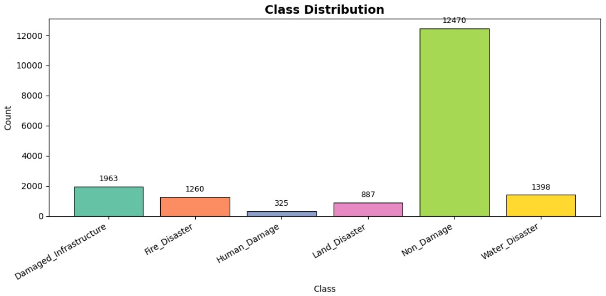
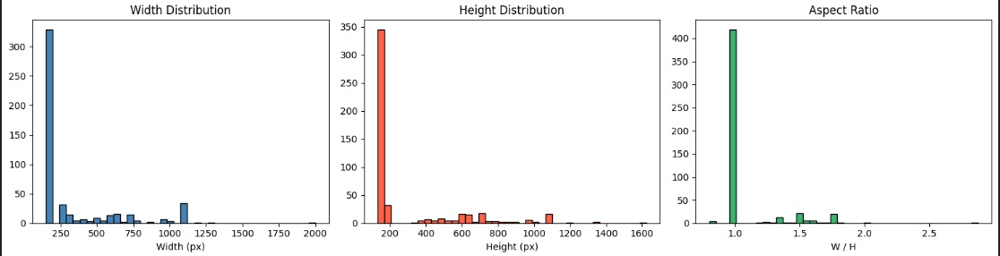
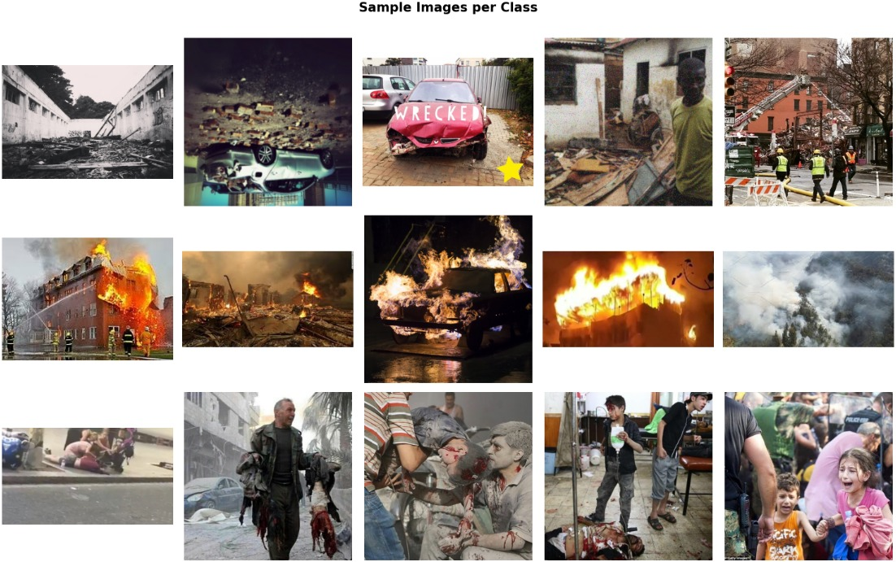
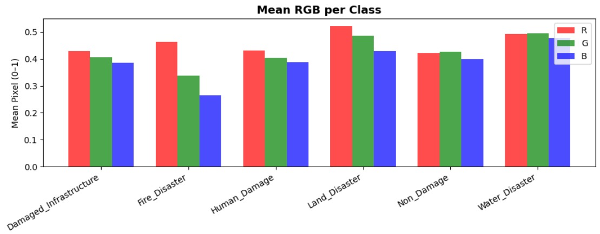
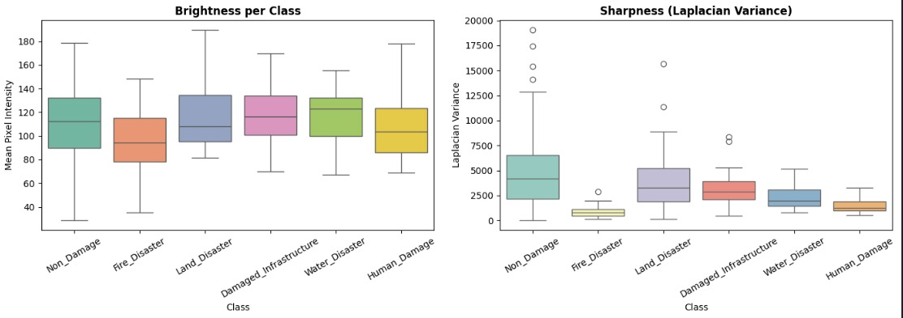
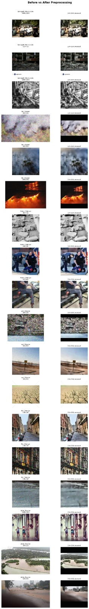
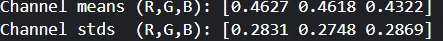
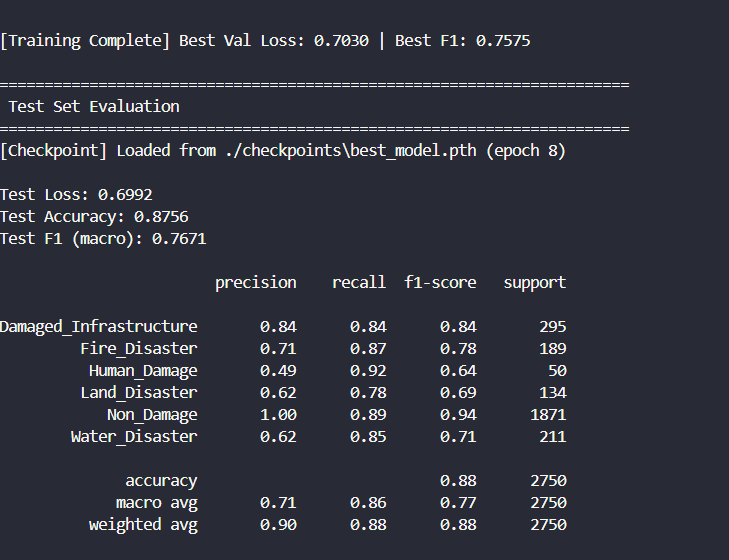
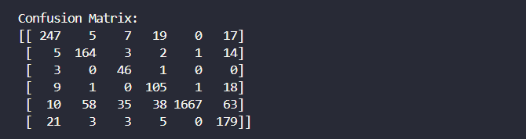
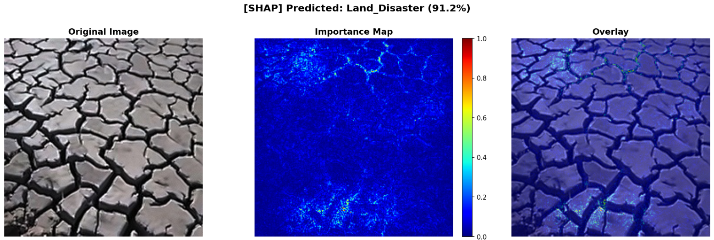

## EDA and Preprocessing Results
1. Class Distruibution

  
2. Width , Hight, Aspect ration

  
3. Sample Images

  
4. MEan RGB per class

  
5. Box Plot and Lalacian Variance

  
6. After Preprocessing comparision

 
 
7. Channel Mean and standard deviation

 
## Model trained for SHAP(SHapley Additive exPlanations) for visualization and analysis
1. Model used : Ensemble learning using efficientNetB3 + CBAM(The Concerns Based Adoption Model)
   - **Results**
   - Accuracy Matrix 
     
   - Confusion Matrix
     
   - SHAP Visualization
     
     
